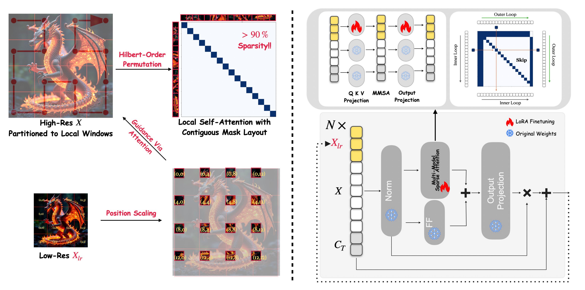

# Scale-DiT: Ultra-High-Resolution Image Generation with Hierarchical Local Attention

[](https://arxiv.org/abs/2510.16325)
[](https://arxiv.org/pdf/2510.16325)

Official code for **Scale-DiT** ([arXiv:2510.16325](https://arxiv.org/abs/2510.16325)):
*Yuyao Zhang, Yu-Wing Tai*.


## Abstract
Ultra-high-resolution text-to-image generation demands both fine-grained texture synthesis and globally coherent structure, yet current diffusion models remain constrained to sub-1K×1K resolutions due to the prohibitive quadratic complexity of attention and the scarcity of native 4K training data. We present **Scale-DiT**, a new diffusion framework that introduces hierarchical local attention with low-resolution global guidance, enabling efficient, scalable, and semantically coherent image synthesis at ultra-high resolutions. Specifically, high-resolution latents are divided into fixed-size local windows to reduce attention complexity from quadratic to near-linear, while a low-resolution latent equipped with scaled positional anchors injects global semantics. A lightweight LoRA adaptation bridges global and local pathways during denoising, ensuring consistency across structure and detail. To maximize inference efficiency, we repermute token sequence in Hilbert curve order and implement a fused-kernel for skipping masked operations, resulting in a GPU-friendly design. Extensive experiments demonstrate that Scale-DiT achieves more than 2× faster inference and lower memory usage compared to dense attention baselines, while reliably scaling to 4K×4K resolution without requiring additional high-resolution training data. On both quantitative benchmarks (FID, IS, CLIP Score) and qualitative comparisons, Scale-DiT delivers superior global coherence and sharper local detail, matching or outperforming state-of-the-art methods that rely on native 4K training. Taken together, these results highlight hierarchical local attention with guided low-resolution anchors as a promising and effective approach for advancing ultra-high-resolution image generation.

## Pipeline



## 🔥 Highlights

- **Ultra-high-resolution** T2I generation up to **4K × 4K** without native 4K training data.
- **Hierarchical local attention** (near-linear scaling) + **low-res global guidance** via scaled positional anchors.
- **LoRA bridge** between global/local pathways during denoising.
- **Very sparse attention** to speed up inference.

## 🎬 Image demos 

Below are example generations with the comparison of high-res output and low-res output after bicubic interpolation.

| Prompt | High-res output | Low-res (after) |
|---|---|---|
| Realistic Persian cat relaxing on a velvet sofa, soft indoor lighting |  |  |
| serene mountain village nestled in the Swiss Alps, traditional wooden chalets with flower boxes, cobblestone paths winding between houses, snow-capped peaks in the background, golden hour lighting, smoke rising from chimneys, villagers in traditional clothing walking the streets, cozy warm atmosphere, detailed architecture, rustic charm. |  |  |
| Ultra-realistic portrait of an elderly man with deep wrinkles, soft window light, 85mm lens, shallow depth of field |  |  |

## Benchmark

Quantitative comparison at **4K × 4K** resolution. **Best** is in **bold**, **second-best** is <ins>underlined</ins>.

| Method | CLIP-IQA ↑ | FID ↓ | FID<sub>patch</sub> ↓ | IS ↑ | IS<sub>patch</sub> ↑ | CLIP Score ↑ |
|---|---:|---:|---:|---:|---:|---:|
| SANA | 0.4457 | 76.31 | 74.27 | 16.68 | **14.02** | 0.3197 |
| Diffusion-4K | 0.3012 | 121.85 | 120.59 | 14.39 | 10.77 | 0.2844 |
| UltraPixel | 0.4421 | 77.42 | 70.94 | 16.98 | 13.26 | **0.3251** |
| URAE | 0.3369 | <ins>67.39</ins> | <ins>62.56</ins> | 17.11 | 12.39 | 0.3204 |
| FLUX+SR (BSRGAN) | 0.3897 | 71.39 | 63.45 | 17.08 | 12.87 | 0.3210 |
| DemoFusion | 0.4392 | 74.89 | 66.37 | 16.23 | 13.02 | 0.3187 |
| DiffuseHigh | 0.4221 | 81.54 | 73.35 | 16.15 | 13.08 | 0.3175 |
| HiDiffusion | 0.4021 | 172.46 | 217.49 | 9.43 | 8.12 | 0.3129 |
| FreCas | 0.2704 | 213.44 | 322.08 | 7.98 | 6.84 | 0.2805 |
| I-MAX | 0.4381 | 70.33 | 65.67 | 16.50 | 12.69 | 0.3211 |
| HiFlow | 0.4407 | 69.18 | 63.72 | <ins>17.13</ins> | <ins>13.43</ins> | 0.3113 |
| **Scale-DiT (Ours)** | **0.4505** | **67.03** | **61.78** | **17.21** | 13.31 | <ins>0.3231</ins> |

## Visualization

Below are qualitative comparisons against other methods:


## 📑 Open-source plan

- Training code ✅
- Inference code ✅
- Model checkpoints (LoRA) ✅ (see `checkpoints/`)

## Installation

You can also install torch from the [official PyTorch website](https://pytorch.org/get-started/).

```bash
conda env create -f environment.yml
conda activate scale-dit
```
To install the sparse attention kernel, please follow the installation instructions provided by SageAttention: [https://github.com/thu-ml/SpargeAttn/tree/main](https://github.com/thu-ml/SpargeAttn/tree/main).

## Inference (quickstart)
Please download the LoRA checkpoint from [here](https://huggingface.co/datasets/yuyao-zhang/Scale-DiT/blob/main/checkpoints/full_lora/pytorch_lora_weights.safetensors) and place it in the `checkpoints` directory.

Use the provided config:

- `train/config/inference.yaml`

You can modify the number of '''hr_inference_steps''' in the config file to get better results / faster inference.

Run:

```bash
export XFL_CONFIG="./train/config/inference.yaml"
accelerate launch -m src.train.train --disable_wandb
```
or
```bash
accelerate config # use bf16 precision
sh script/inference.sh
```

You can modify the test prompts in the `train/config/prompt.txt` file. (which is loaded in the `src/train/callbacks.py` file line 120 you can modify the path to the file if you want to use your own prompts.)

## Training scripts

Run:
```bash
  accelerate config # use bf16 precision and set the number of GPUs you want to use
  sh script/train.sh
```

## Repo layout

- `src/flux/`: pipeline + transformer + generation
- `src/train/`: Lightning module, dataset wrapper, callbacks
- `train/config/`: example configs/prompts
- `train/script/`: convenience launch scripts


## Citation

If you find this work useful, please cite:

```bibtex
@misc{zhang2025scaledit,
  title        = {Scale-DiT: Ultra-High-Resolution Image Generation with Hierarchical Local Attention},
  author       = {Yuyao Zhang and Yu-Wing Tai},
  year         = {2025},
  eprint       = {2510.16325},
  archivePrefix= {arXiv},
  primaryClass = {cs.CV},
  doi          = {10.48550/arXiv.2510.16325},
  url          = {https://arxiv.org/abs/2510.16325}
}
```

## License

Use the [LICENSE.html](LICENSE.html) file for the license. The code is released under the [MIT License](LICENSE.html).


