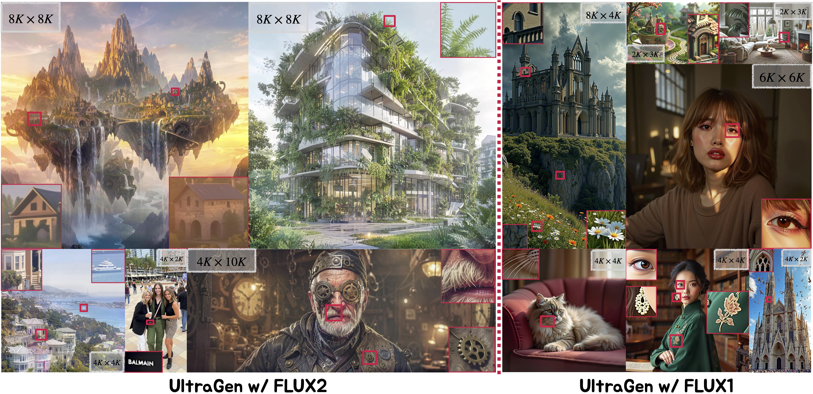
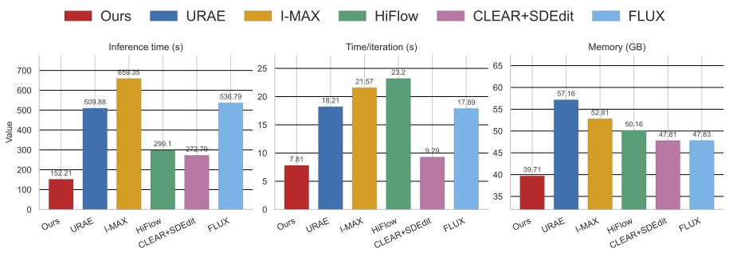
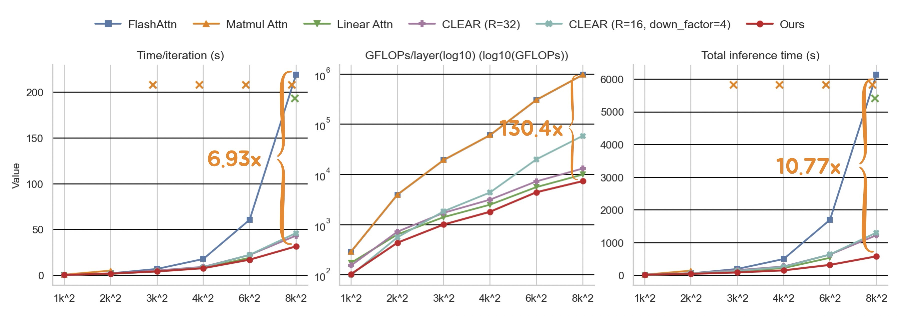

# UltraGen: Efficient Ultra-High-Resolution Image Generation with Hierarchical Local Attention

[](https://arxiv.org/abs/2510.16325)
[](https://arxiv.org/pdf/2510.16325)

Official code for **UltraGen** ([arXiv:2510.16325](https://arxiv.org/abs/2510.16325)):
*Yuyao Zhang, Yu-Wing Tai*.





## Abstract
Ultra-high-resolution text-to-image generation is increasingly vital for applications requiring fine-grained textures and global structural fidelity, yet state-of-the-art text-to-image diffusion models such as FLUX and SD3 remain confined to sub 2MP (< $1K\times2K$) resolutions due to the quadratic complexity of attention mechanisms and the scarcity of high-quality high-resolution training data. We present \textbf{\ourwork}, a novel framework that introduces hierarchical local attention with low-resolution global guidance, enabling efficient, scalable, and semantically coherent image synthesis at ultra-high resolutions. Specifically, high-resolution latents are divided into hardware aligned fixed-size local windows to reduce attention complexity from quadratic to near-linear, while a low-resolution latent equipped with scaled positional embeddings injects global semantics as an anchor. A lightweight LoRA adaptation bridges global and local pathways during denoising, ensuring consistency across structure and detail. To maximize inference efficiency and achieve scalable ultra-high-resolution generation, we repermute token sequence in window-first order, so that the GPU-friendly dense local blocks in attention calculation equals to the fixed-size local window in 2D regardless of resolution. Together~\ourwork~reliably scales the pretrained model to resolutions higher than $8K$ with more than $10\times$ speed up and significantly lower memory usage. Extensive experiments demonstrate that~\ourwork~achieves superior quality while maintaining computational efficiency, establishing a practical paradigm for advancing ultra-high-resolution image generation.

## 🔥 Highlights

- **Ultra-high-resolution** T2I generation to **>8K × 8K** without native UHR (Ultra-High-Resolution) training data.
- **Hierarchical local attention** (near-linear scaling) + **low-res global guidance** via scaled positional anchors.
- **LoRA bridge** between global/local pathways during denoising.
- **Very sparse attention** to speed up inference and memory usage.

## Performance
### Qualitative Comparison



*Comparison of latency (seconds to generate one 4K latent, 65536 tokens), time per iteration (seconds), and memory usage (GB) across FLUX.1-dev-based 4K generation methods. Our method achieves significant speedup and memory reduction.*


**Efficiency comparisons across resolutions (1K to 8K).** We report per-iteration latency (**Left**), floating-point operations per attention layer (**Middle**), and total inference time (**Right**) for our method, naive matrix multiplication attention, Linear Attention, FlashAttention-2, and two linearized attention configurations from CLEAR. At 8K resolution, our method achieves a 6.93× per-iteration speedup, 130.4× reduction in attention computation, and 10.77× total inference speedup over FLUX with FlashAttention, while consistently outperforming CLEAR and Linear Attention across all metrics. The "X" mark means out-of-memory (OOM). Linear Attention reaches OOM at 8K resolution, while the naive one reaches OOM at 3K resolution.

## 📑 Open-source plan

- Training code ✅
- Inference code ✅
- Model checkpoints (LoRA) ✅ (see `ckpts/`)

## Installation

You can also install torch from the [official PyTorch website](https://pytorch.org/get-started/).

```bash
conda env create -f environment_config.yml
conda activate ultragen
```
To install the sparse attention kernel, please follow the installation instructions provided by SageAttention: [https://github.com/thu-ml/SpargeAttn/tree/main](https://github.com/thu-ml/SpargeAttn/tree/main).

## Inference (quickstart)
Please download the LoRA checkpoint from [here](https://drive.google.com/drive/folders/1dSlbqCOErwTyHZ-BenAabZv49ylEzHic?usp=share_link) and place it in the `ckpts` directory.

Use the provided config for 4 step inference:

- `train/config/inference_flux2.yaml`

You can also use the provided config for 28 step inference:

- `train/config/infer_flux-base.yaml`

You can modify the number of '''hr_inference_steps''' in the config file to get better results / faster inference.

Run:

```bash
export XFL_CONFIG="./train/config/inference.yaml"
accelerate launch -m src.train.train --disable_wandb
```
or
```bash
accelerate config # use bf16 precision
sh script/infer_flux2.sh # for 4 step inference with FLUX.2-klein-9b
sh script/infer_flux-base.sh # for 28 step inference with FLUX.2-klein-base-9b
```

You can modify the test prompts in the `prompt.txt` file. (which is loaded in the `src/train/callbacks2.py` file line 120 you can modify the path to the file if you want to use your own prompts.)

## Training scripts

Run:
```bash
  accelerate config # use bf16 precision and set the number of GPUs you want to use
  sh script/train_flux2.sh
```

## Repo layout

- `src/flux/`: pipeline + transformer + generation
- `src/train/`: Lightning module, dataset wrapper, callbacks
- `train/config/`: example configs/prompts
- `train/script/`: convenience launch scripts


## Citation

If you find this work useful, please cite:

```bibtex
@misc{zhang2025scaledit,
  title        = {UltraGen: Efficient Ultra-High-Resolution Image Generation with Hierarchical Local Attention},
  author       = {Yuyao Zhang and Yu-Wing Tai},
  year         = {2025},
  eprint       = {2510.16325},
  archivePrefix= {arXiv},
  primaryClass = {cs.CV},
  doi          = {10.48550/arXiv.2510.16325},
  url          = {https://arxiv.org/abs/2510.16325}
}
```

## License

Use the [LICENSE.html](LICENSE.html) file for the license. The code is released under the [MIT License](LICENSE.html).


